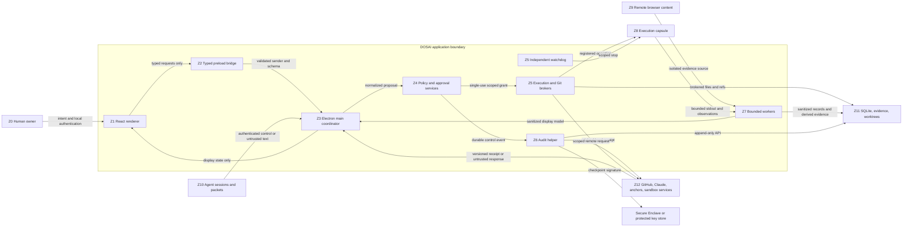

# DOSAI Trust-Boundary and Threat Model

**Document status:** `[x] BASELINE_COMPLETE` 
**Status updated:** `2026-07-31T02:01:37-04:00` 
**Applies to:** Phase 0 architecture and all later implementation phases 
**Capability implication:** None; all implementation capabilities remain
`UNVERIFIED` until tested.

This document defines the security boundaries, data flows, invariants, and
tracked threats that constrain DOSAI implementation. It operationalizes the
authoritative product specification, `SECURITY.md`, and controls F01-F12 in the
audit remediation register.

## Security Objective

DOSAI may coordinate untrusted agents and inspect untrusted local or remote data,
but those inputs must not gain authority merely by entering the application.
Only the owner and narrowly scoped trusted services may authorize effects. Every
effect must be bounded, attributable, cancellable where technically possible,
and evidenced without retaining prohibited data.

## Threat Actors and Failure Sources

- Malicious or prompt-injected repository, terminal, browser, model, packet, or
  skill content.
- A compromised renderer, remote `WebContentsView`, worker, child process, or
  agent session.
- A confused or mistaken agent that requests an effect outside its assignment.
- Benign concurrency, crashes, resource exhaustion, stale state, malformed data,
  dependency defects, and incomplete cleanup.
- A compromised external account, integration, package, update, or remote policy.
- A local administrator or compromised operating system. DOSAI can make some
  actions by this actor detectable, but cannot fully contain this actor.

## Protected Assets

| Asset | Required property |
| --- | --- |
| Owner intent and approval | Bound to one immutable action plan and target state. |
| Policy and security configuration | Versioned, deny-first, and unavailable to untrusted writers. |
| Execution grants | Short-lived, single-use, scoped, and inaccessible to renderers and agents. |
| Audit signing key | Non-exportable where supported and isolated from general application code. |
| Audit journal | Ordered, sanitized, tamper-evident, and externally anchorable. |
| Source repository and worktrees | Single-writer ownership, exact identity, and no default-branch mutation. |
| Browser and account state | Dedicated non-production profile with no secret extraction or persistence. |
| Canonical evidence | Exact permitted bytes, provenance, bounded retention, and digest integrity. |
| Local database and search index | Sanitized input, controlled access, retention, and verified deletion. |
| Remote accounts and resources | Exact identity, least privilege, non-production defaults, and version preconditions. |

## Trust Zones

| Zone | Components | Trust posture | May hold authority? |
| --- | --- | --- | --- |
| Z0 | Human owner and native owner-authentication UI | Root decision authority within policy | Yes, for explicit decisions |
| Z1 | React renderer and dashboard state | Compromise-tolerant presentation layer | No |
| Z2 | Preload bridge and IPC schema adapters | Narrow validation boundary | No independent authority |
| Z3 | Electron main coordinator | Privileged orchestrator, not a signing or execution authority | Routing only |
| Z4 | Policy kernel, approval service, grant store | Trusted reference monitor | Yes, narrowly scoped |
| Z5 | Execution broker, supervisor, watchdog, Git broker | Trusted effect and stop boundary | Only with valid grants |
| Z6 | Audit helper and protected key | Trusted journal and checkpoint signer | Audit signing only |
| Z7 | Persistence, evidence, parser, image, and compression workers | Constrained processors of sanitized or untrusted data | No |
| Z8 | Execution capsules and repository processes | Potentially hostile code | No |
| Z9 | Remote browser content and ephemeral browser session | Hostile remote content | No |
| Z10 | Agent sessions, model output, packets, skills, and repository content | Untrusted proposals and data | No |
| Z11 | SQLite, evidence store, worktrees, and local files | Mutable storage requiring brokered access | No |
| Z12 | GitHub, approved Claude surface, future sandbox services, and anchor target | External and independently administered | Only within scoped credentials |

## Trust-Boundary Diagram

## Boundary Rules

### Z0 to Z1: Owner Interaction

- The renderer may display and collect intent but cannot manufacture approval.
- Red-tier approval is produced by a trusted native service after owner
  authentication and is bound to one action-plan digest.
- Close, timeout, application sleep, authentication failure, or stale state means
  deny.

### Z1 to Z3: Renderer, Preload, and Main

- Renderer Node integration is disabled; context isolation and process sandboxing
  are enabled.
- Preload exposes individual typed methods, never raw `ipcRenderer`, filesystem,
  database, shell, process, credential, or browser-debugging APIs.
- Main validates sender frame, origin, channel, schema version, field bounds, and
  operation identity for every request.
- No incoming IPC request carries an execution grant, approval record, signing
  key, or trusted provenance assertion.

Electron's security guidance requires context isolation, process sandboxing,
restricted navigation, and IPC sender validation for untrusted content:
<https://www.electronjs.org/docs/latest/tutorial/security>.

### Z3 to Z4: Proposal to Authorization

- Main may propose an operation but cannot approve it.
- The policy kernel canonicalizes the full request, computes the minimum tier,
  validates target identity and capabilities, and fails closed on unknown input.
- Approval and execution grants are stored internally and referenced by opaque
  identifiers; untrusted callers cannot supply their contents.

### Z4 to Z5: Authorization to Effect

- The execution broker accepts only a valid, unexpired, unused grant whose digest
  matches the current immutable action plan.
- Every target precondition is revalidated immediately before use through stable
  handles, locks, transactions, or compare-and-swap where supported.
- Only Z5 may import or invoke process-spawn and mutable Git primitives.

### Z5 to Z8: Execution Capsule

- Fixed harmless host operations may use tightly constrained host handlers.
- Arbitrary repository code requires the approved disposable isolation backend.
- The supervisor owns process identity, limits, outputs, descendants, timeout,
  and cleanup. Detachment is denied.
- The watchdog's stop path does not depend on renderer, main-loop, worker,
  persistence, or audit availability.

### Z3 and Z7 to Z9: Browser Inspection

- Remote pages run only in a sandboxed `WebContentsView` with no Node integration
  and an in-memory, non-`persist:` session partition.
- A broker mediates navigation, permissions, downloads, popups, and CDP access.
- Cookies, storage, credentials, authorization headers, and raw bodies never
  cross into renderer, prompts, packets, logs, or persistence.
- Evidence is bounded, classified, and redacted before leaving the worker.

Electron documents that partitions without `persist:` are in-memory sessions:
<https://www.electronjs.org/docs/latest/api/session>.

### Z7 to Z11: Persistence and Evidence

- Repository, browser, terminal, packet, model, and skill content enters as
  untrusted data.
- Prohibited data is rejected before persistence; failures record only sanitized
  reason codes.
- Canonical sanitized evidence is stored separately from lossy derivatives.
- SQLite, FTS, caches, artifacts, exports, and managed backups participate in one
  retention and deletion protocol.
- FTS and compression outputs are derived data and have no policy or audit
  authority.

### Z3 to Z6: Audit

- The audit helper accepts only a strict sanitized event schema over an
  authenticated local channel.
- It allocates sequence numbers, creates the hash chain, and signs checkpoints;
  agents and renderers may submit claims only with an explicit untrusted
  provenance class.
- A durable intent event must precede any new effect. A stop action is never
  delayed when audit is unavailable; the resulting gap is reconciled afterward.
- The assurance claim is tamper-evident within the documented threat model, not
  immutable or tamper-proof.

### Z5 to Z11: Workspaces and Git

- Owner-issued leases bind exact repository, Git common directory, worktree,
  branch ref, base SHA, path scope, actor, policy version, and expiry.
- Agents receive isolated worktrees, not shared main-worktree access.
- The Git broker sanitizes configuration and environment, denies hooks and
  caller-provided refspecs, and updates refs using expected-old-value semantics.

### Z3 and Z5 to Z12: External Services

- Every connector has an explicit account, origin, environment, operation,
  capability, credential scope, timeout, retry, and reconciliation policy.
- Responses remain untrusted until schema and identity checks succeed.
- Mutations use idempotency keys and resource-version preconditions when
  supported.
- Agent credentials cannot approve, merge, bypass policy, or mutate protected
  default branches.

## Data Classes

| Class | Examples | Handling rule |
| --- | --- | --- |
| D0 Prohibited | Passwords, tokens, cookies, private keys, session storage, auth headers, production customer data | Do not inspect, transmit, hash, prompt, log, or persist; stop and report safely. |
| D1 Trusted control | Policy versions, grants, approval records, signing-key references | Create and consume only inside trusted services; never expose raw values to renderer or agents. |
| D2 Canonical sanitized evidence | Approved code patch, redacted screenshot, bounded command result | Exact digest, provenance, purpose-bound access, and short retention. |
| D3 Derived evidence | AST summary, DOM delta, pHash result, timeline thumbnail | Label as derived and lossy where applicable; never use alone for safety decisions. |
| D4 Untrusted content | Repository text, browser DOM, stdout, model output, packets, skill drafts | Quote, bound, validate, and prevent authority promotion. |
| D5 Public operational metadata | App version, supported schema versions, published public keys | Integrity-protected but not confidential. |

## Global Security Invariants

| ID | Invariant |
| --- | --- |
| I01 | No valid grant means no new external effect. |
| I02 | The renderer and agents never receive raw privileged APIs, approvals, grants, credentials, or signing keys. |
| I03 | Unknown operation, schema, target, identity, policy, or environment fails closed. |
| I04 | Stdout, browser content, repository content, model output, skills, and external responses remain untrusted data. |
| I05 | D0 prohibited data never crosses the persistence, prompt, packet, screenshot, export, or audit boundary. |
| I06 | Emergency stop remains available when renderer, main, audit, persistence, or workers are unavailable. |
| I07 | Cancellation affects every owned resource in scope and no unrelated resource. |
| I08 | Approval authorizes one immutable plan and becomes stale on any decision-relevant change. |
| I09 | Workspace authority comes from an owner-issued lease, not a branch name or path string. |
| I10 | Lossy evidence cannot satisfy an approval, security, incident, or audit precondition. |
| I11 | Audit preservation does not prove observation truth; provenance class is always explicit. |
| I12 | Audit integrity is described as tamper-evident only through the latest independently retained checkpoint. |
| I13 | A safety stop may proceed without audit acknowledgement; a new effect may not. |

## Threat Register

`EVIDENCE_PENDING` means the control design is accepted but no implementation
proof exists yet.

| ID | Severity | Threat or failure | Required mitigation | Control | Proof phase | Status |
| --- | --- | --- | --- | --- | --- | --- |
| T01 | Critical | Execution path bypasses policy or audit | Sole broker, grant requirement, import boundary, durable pre-effect event | F01 | P2 | `[?] EVIDENCE_PENDING` |
| T02 | Critical | Shell, wrapper, hook, or interpreter hides effects | Typed operations, exact executable identity, sanitized environment, isolation | F02 | P3 | `[?] EVIDENCE_PENDING` |
| T03 | Critical | Stdout or hostile text forges a control packet | Separate framed authenticated channel with replay and size controls | F03 | P5 | `[?] EVIDENCE_PENDING` |
| T04 | Critical | Renderer compromise invokes privileged IPC | Sandboxing, context isolation, narrow preload, sender and schema validation | F01 | P1-P2 | `[?] EVIDENCE_PENDING` |
| T05 | Critical | Secret reaches renderer, prompt, packet, log, or database | D0 rejection before boundary crossing; dedicated test identities and profiles | F04, F10 | P6-P7 | `[?] EVIDENCE_PENDING` |
| T06 | High | Remote browser content escapes into local authority | Isolated `WebContentsView`, no Node integration, permission and navigation broker | F04 | P6 | `[?] EVIDENCE_PENDING` |
| T07 | High | Load blocks emergency stop | Bounded workers, backpressure, priority path, independent watchdog | F05 | P3 | `[?] EVIDENCE_PENDING` |
| T08 | High | Cancellation misses descendants or kills unrelated apps | Capsule registry, process identity, deny detachment, scoped escalation | F06 | P3 | `[?] EVIDENCE_PENDING` |
| T09 | High | Approved target changes before execution | Immutable action-plan digest, stable handles, revalidation, compare-and-swap | F07 | P2, P4 | `[?] EVIDENCE_PENDING` |
| T10 | High | Branch or path labels are used as authority | Owner-issued workspace lease, isolated worktree, canonical identities | F08 | P4 | `[?] EVIDENCE_PENDING` |
| T11 | High | Git config, environment, hook, alias, or refspec redirects mutation | Sanitized typed Git broker and fixed destinations | F08 | P4 | `[?] EVIDENCE_PENDING` |
| T12 | High | Symlink, traversal, case, Unicode, hard link, or nested repo escapes scope | Descriptor-based identity checks, normalization, file-type and ancestry policy | F08, F09 | P4, P8 | `[?] EVIDENCE_PENDING` |
| T13 | High | Malicious skill metadata enters every agent context | Quarantine before indexing or manifest injection | F09 | P8 | `[?] EVIDENCE_PENDING` |
| T14 | High | Approved skill or dependency changes before invocation | Content-address complete bundle and invoke exact approved digest | F09 | P8 | `[?] EVIDENCE_PENDING` |
| T15 | High | Deleted event remains in FTS, WAL, cache, artifact, export, or backup | Preventive minimization and resumable multi-store deletion protocol | F10 | P7 | `[?] EVIDENCE_PENDING` |
| T16 | High | Audit history is edited, truncated, forked, or rolled back | Sequence, hash chain, protected checkpoints, external receipts, verifier | F12 | P2, P7, P11 | `[?] EVIDENCE_PENDING` |
| T17 | High | External effect occurs but outcome is not logged after crash | Durable intent, idempotency, explicit unknown outcome, startup reconciliation | F12 | P2-P3 | `[?] EVIDENCE_PENDING` |
| T18 | High | Agent claim is presented as independently observed truth | Authenticated identity plus explicit provenance class | F03, F12 | P5, P7 | `[?] EVIDENCE_PENDING` |
| T19 | High | External credential permits production or policy bypass | Dedicated accounts, least privilege, environment identity, endpoint denial | F02, F07 | P4, P10 | `[?] EVIDENCE_PENDING` |
| T20 | High | Dependency or application update changes a trusted component | Lockfiles, signatures, provenance review, staged updates, rollback policy | F02, F12 | P1, P11 | `[?] EVIDENCE_PENDING` |
| T21 | Medium | pHash suppresses a small but critical visual change | Critical-event bypass, canonical frames, multi-signal capture, loss labels | F11 | P9 | `[?] EVIDENCE_PENDING` |
| T22 | Medium | AST or log pruning removes causal or semantic context | Canonical source, parser-error fallback, deterministic chunks, omissions | F11 | P9 | `[?] EVIDENCE_PENDING` |
| T23 | Medium | SQLite or parsing work exhausts CPU, memory, disk, or queue capacity | Input limits, worker quotas, backpressure, retention, disk reserve, fail closed | F05, F10 | P3, P7 | `[?] EVIDENCE_PENDING` |
| T24 | Medium | Replay or stale state reuses approval, grant, packet, lease, or remote request | Nonces, sequence, expiry, single use, policy version, idempotency | F03, F07, F08 | P2, P4, P5 | `[?] EVIDENCE_PENDING` |
| T25 | Medium | Browser, worker, or capsule survives session teardown | Ownership registry, explicit teardown, postcondition verification, startup recovery | F04, F06 | P3, P6 | `[?] EVIDENCE_PENDING` |
| T26 | Medium | User is misled by an incomplete timeline or assurance badge | Explicit gaps, source labels, anchored-through sequence, no invented replay | F11, F12 | P9, P11 | `[?] EVIDENCE_PENDING` |
| T27 | Medium | Local administrator deletes future logs or stops anchoring | External liveness and receipts; document that prevention is out of scope | F12 | P11 | `[?] EVIDENCE_PENDING` |
| T28 | Medium | Manual fallback bypasses classification or evidence rules | Apply the same target, data, approval, and evidence checklist to fallback | F01, F04 | P0, P10 | `[?] EVIDENCE_PENDING` |

## Residual Risks and Non-Claims

- DOSAI cannot fully contain a compromised macOS kernel, local administrator,
  malicious firmware, or physical hardware attacker.
- A cryptographic signature preserves a statement; it does not prove that the
  statement is true.
- An external checkpoint detects rollback only through the latest independently
  retained receipt. Activity after that receipt has an explicit exposure window.
- Deletion from DOSAI-managed stores does not prove erasure from user-created
  exports, unmanaged backups, filesystem snapshots, or SSD remanence.
- Isolation reduces arbitrary-code risk but does not eliminate virtualization,
  browser-engine, Electron, Node.js, or dependency vulnerabilities.
- A remote provider or repository administrator with bypass authority remains a
  separate trust risk that local controls cannot eliminate.

## Implementation Guidance

- Treat Electron's renderer sandbox and macOS App Sandbox as complementary
  containment layers, not substitutes for brokered authority. Apple describes App
  Sandbox as kernel-enforced restriction to declared resources:
  <https://developer.apple.com/documentation/xcode/configuring-the-macos-app-sandbox>.
- Prefer separate processes with distinct entitlements for signing, audit,
  execution, persistence, evidence processing, and browser inspection when the
  required capability sets differ.
- Keep the main coordinator responsive and free of synchronous database, parser,
  image, and unbounded stream work.
- Convert each threat-register row into at least one negative acceptance test
  before the phase that first exposes the threatened capability.

## Maintenance Rule

Any new component, IPC channel, storage location, credential, remote origin,
privileged API, or data class must update this document and receive an ADR before
implementation. Threats are marked mitigated only after evidence is reviewed and
the corresponding capability matrix status is updated.
